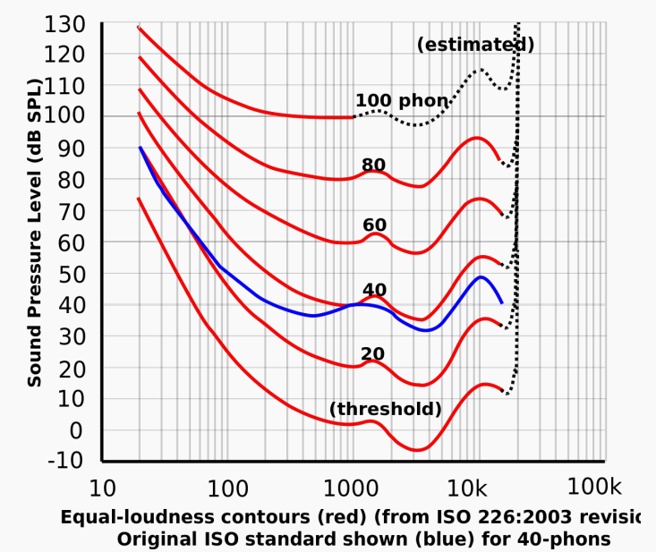
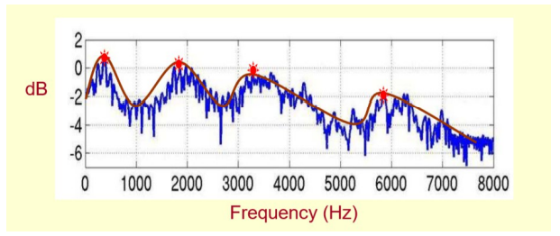
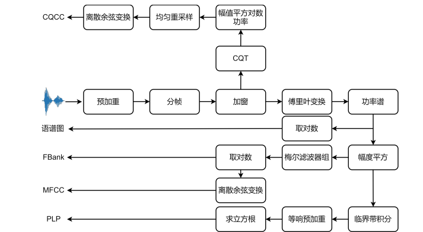

### 1 语音基本概念

声波通过空气传播，被麦克风接收，通过采样、量化、编码转换为离散的数字信号，即波形文件。音量、音高和音色是声音的基本属性。

#### 1.1 能量

音频的能量通常指的是时域上每帧的能量，幅度的平方。在简单的**语音活动检测（Voice Activity Detection，VAD）**中，直接利用能量特征：能量大的音频片段是语音，能量小的音频片段是非语音（包括噪音、静音段等）。这种 VAD 的局限性比较大，正确率也不高，对噪音非常敏感。

#### 2.2 短时能量 

短时能量体现的是信号在不同时刻的强弱程度。设第 n 帧语音信号的短时能量用 $E_n$ 表示，则其计算公式为：

$$
E_n = \sum_{m=0}^{M-1} x_n^2(m)
$$

上式中，𝑀 为帧长， $x_n(m)$ 为该帧中的样本点。

#### 1.3声强和声强级 

单位时间内通过垂直于声波传播方向的单位面积的平均声能，称作声强，声强用 I 表示，单位为“瓦/平米”。 实验研究表明，人对声音的强弱感觉并不是与声强成正比，而是与其对数成正比，所以一般声强用声强级来表示：  

$$
L = 10 log(\frac{I}{I^{'}})
$$

其中，I 为声强， $𝐼′ = 10𝑒^{-12}𝑤/𝑚^2$ 称为基本声强，声强级的常用单位是分贝(dB)。

#### 1.4响度

响度是一种主观心理量，是人类主观感觉到的声音强弱程度，又称**音量**。**响度与声强和频率有关** 。一般来说，声音频率一定时，声强越强，响度也越大。相同的声强，频率不同时，响度也可能不同。响度若用对数值表示，即为响度级，响度级的单位定义为方，符号为 phon。根据国际协议规定，0dB 声强级的 1000Hz 纯音的响度 级定义为 0 phon，n dB 声强级的 1000Hz 纯音的响度级就是 n phon。其它频率的声强级与响度级的对应关系要从下图等响度曲线查出。



#### 1.5过零率 

过零率体现的是信号过零点的次数，体现的是频率特性。

$$
Z_n=\sum_{n=0}^{N-1}\sum_{m=0}^{M-1}|sgn(x_n(m))-sgn(x_n(m-1))|
$$

其中，𝑁 表示帧数，𝑀 表示每一帧中的样本点个数，sgn 为符号函数，即

$$
sgn=
\begin{cases}
1 &, x\geq5 \\
-1 &, x<5
\end{cases}
$$

#### 1.6共振峰

声门处的准周期激励进入声道时会引起共振特性，产生一组共振频率，这一组共振频率称为**共振峰频率**或简称**共振峰**。共振峰包含在语音的频谱**包络**中，频谱包络的局部极大值就是共振峰。频率最低的共振峰称为第一共振峰，记作 𝑓1，频率更高的共振峰称为第二共振峰 𝑓2、第三共振峰 𝑓3⋯⋯以此类推。实践中一个元音用三个共振峰表示，复杂的辅音或鼻音，要用五个共振峰。参见：[不同元音辅音在声音频谱的表现是什么样子？什么是共振峰?](https://www.zhihu.com/question/27126800/answer/35376174)

#### 1.7基频和基音周期 

基音周期反映了声门相邻两次开闭之间的时间间隔，基频（fundamental frequency，f0/F0）则是基音周期的倒数，对应着声带振动的频率，代表声音的音高，声带振动越快，基频越高。它是语音激励源的一个重要特征， 比如可以通过基频区分性别。一般来说，成年男性基频在 100∼250Hz 左右，成年女性基频在 150∼350Hz 左右， 女声的音高一般比男声稍高。

如图所示，蓝色箭头指向的明亮横线对应频率就是**基频**，决定音高；而绿框中的明亮横线统称为**谐波**。**谐波是基频对应的整数次频率成分**，由声带发声带动空气共振形成的，对应着声音三要素的音色。谐波的位置，相邻的距离共同形成了音色特征。谐波之间距离近听起来则偏厚粗，之间距离远听起来偏清澈。在男声变女声的时候，除了基频的移动，还需要调整谐波间的包络，距离等，否则将会丢失音色信息。 


人类可感知声音的频率大致在 20-20000Hz 之间，人类对于基频的感知遵循对数律，也就是说，人们会感觉 100Hz 到 200Hz 的差距，与 200Hz 到 400Hz 的差距相同。因此，音高常常用基频的对数来表示。在音乐上，把相差一倍的两个基频的差距称为一个八度（octave）；把一个八度 12 等分，每一份称为一个半音（semitone）；把 一个半音再 100 等分，每一份称为一个音分（cent）。

基频是语音的重要特征，在包括语音合成的语音处理中有着广泛的应用，比如**语音转换**（Voice Conversion， VC）和语音合成中基频是一个强特征。基频的提取可以分为时域法和频域法。时域法以波形为输入，基本原理是寻找波形的最小正周期；频域法则会先对信号进行傅里叶变换，得到频谱，频谱在基频的整倍数处有尖峰，频域法的基本原理就是求出这些尖峰频率的最大公约数。但是考虑到基频并非每一帧都有，因此在提取基频前后， 都需要判断有无基频，称之为清浊音判断（Unvoiced/Voiced Decision，U/V Decision）。语音的基频往往随着时间 变化，在提取基频之前往往要进行分帧，逐帧提取的基频常常含有错误，其中常见的错误就是倍频错误和半频错误，也就是提取出来的基频是真实基频的两倍或者一半，因此基频提取后要进行平滑操作。常见的基频提取算法有基于信号处理时域法的 YIN，基于信号处理频域法的 SWIPE，基于机器学习时域法的 CREPE和基于 机器学习频域法的 SPICE。常用的基频提取工具有pyWORLD，Parselmouth，CREPE，YIN等。参见[基频提取算法综述](https://zhuanlan.zhihu.com/p/269107205)。 

#### 1.8音高 

音高（pitch）是由声音的基频决定的，音高和基频常常混用。可以这样认为，音高（pitch）是稀疏离散化的 基频（F0）。由规律振动产生的声音一般都会有基频，比如语音中的元音和浊辅音；也有些声音没有基频，比如 人类通过口腔挤压气流的清辅音。在汉语中，元音有 a/e/i/o/u，浊辅音有 y/w/v，其余音素比如 b/p/q/x 等均为清 辅音，在发音时，可以通过触摸喉咙感受和判断发音所属音素的种类。  

#### 1.9MFCC 和语谱图 

对语音进行分析和处理时，部分信息在时域上难以分析，因此往往会提取频谱特征。在语音合成中，通常将频谱作为中间声学特征：首先将文本转换为频谱，再将频谱转换为波形；在语音识别中，则将频谱或者 MFCC 作为中间声学特征。语音通过**预加重、分帧、加窗、傅里叶变换**之后，取功率谱的幅度平方，进行梅尔滤波取对 数之后，就得到了**梅尔频谱**（或称 FilterBank/FBank），如果再进行离散余弦变换，就能够获得 **MFCC**，下一章将进行详述。语音通常是一个短时平稳信号，在进行傅里叶变换之前，一般要进行分帧，取音频的一个小片段进行**短时傅里叶变换（STFT）**。STFT 的结果是一个复数，包括幅度和相位信息，将该复数中的频率作为横轴，幅度作为纵轴，下面第一个图所示，就组成了频谱图，将频谱图中的尖峰点连接起来，就形成了频谱包络。注意到，频谱图反映一个语音帧的频域情况，没有时间信息。因此，将每个帧对应的频谱图连接起来，以时间作为横轴，频率作为纵轴，颜色深浅表示幅度，如下面红图所示，就组成了语谱图。语谱图实际上是一个三维图，横轴时间，纵轴频率，颜色深浅表示幅度大小，一般来说，颜色越深，表示幅度值越大。 




#### 1.10 其他概念

1. **波形（waveform）**: 声音是由声源振动产生的波。 

2. **信道**: 通信的通道 Channel，是信号传输的媒介。 

3. **声道**: 声音在录制和播放时，在不同空间位置采集或回放相互独立的音频信号，因此声道数也就是声音录制时的音源数量或回放时相应的扬声器数量。 

4. **采样率**：单位时间内从连续信号中提取并组成离散信号的采样个数，音频常用单位 kHz。 

5. **采样位数/采样深度**：数字信号的二进制位数，与每次采样的可能值个数有关，音频常用单位 bit。常见的音频格式：16kHz、16bit。其中 16kHz 指的是采样率，16bit 表示采样位深。 

6. **信噪比（SNR）**：和声压级类似，单位仍采用分贝，数值越高，表示声音越干净，噪音比例越小。 

7. **LPC**。线性预测系数。LPC 的基本思想是，当前时刻的信号可以用若干历史时刻信号的线性组合来估计，通过使实际语音的采样值和线性预测的采样值之间达到均方差最小，即可得到一组线性预测系数。求解 LPC 系数可以采用自相关法、协方差法、格型法等快速算法。  

8. **LPCC。** LPCC 特征假定信号存在一种线性预测的结构，这对于周期特性的浊音描述比较准确，而对于辅音则相当于强加了一种错误的结构。MFCC 相邻帧特征近乎独立，所以能够比较好地描述辅音，但忽略了信号可能的内在结构，如相邻帧之间的关联，经验表明 MFCC 更好用，并且经常会加入差分特征以减弱其独立性。

9. **时域和频域**

   （1）什么是信号的时域和频域？
   时域和频域是信号的基本性质，用来分析信号的 **不同角度** 称为 **域** ，一般来说，**时域**的表示较为**形象与直观**，**频域**分析则更为简练，剖析问题更为**深刻和方便**。目前，信号分析的趋势是从时域向频域发展。然而，它们是互相联系，缺一不可，相辅相成的。
   （2）时频域的关系是什么？
   时域分析与频域分析是对模拟信号的**两个观察面**。对信号进行时域分析时，有时一些信号的时域参数相同，但并不能说明信号就完全相同。因为信号不仅随时间变化，还与频率、相位等信息有关，这就需要进一步分析信号的频率结构，并在频率域中对信号进行描述。动态信号从时间域变换到频率域主要通过傅立叶级数和傅立叶变换实现。周期信号的变换采用**傅立叶级数**，非周期信号的变换采用**傅立叶变换**。
   （3）信号的时域和频域表达方式各有什么特点？

   我们描述信号的方式有时域和频域两种方式，**时域**是描述数学函数或物理信号对**时间**的关系，而**频域**是描述信号在**频率方面**特性时用到的一种坐标系，简单来说，横坐标一个是时间，一个是频率。一般正弦信号可由幅值、频率、相位三个基本特征值就可以唯一确定。但对于两个形状相似的非正弦波形，从时域角度，很难看出两个信号之间的本质区别，这就需要用到频域表达方式。

   **小结**

   时域：**自变量是时间**，即横轴是时间，纵轴是信号的变化（振幅）。其动态信号x(t)是描述信号在不同时刻取值的函数。
   频域：**自变量是频率**，即横轴是频率，纵轴是该频率信号的幅度（振幅），就是指的信号电压大小，也就是通常说的频谱图。

10. **频谱图和语谱图**

  **频谱图**：表现的是一段音频在**某一时刻**各个频率的音量的高低，其**横轴是频率**方向，**纵轴为振幅**方向。 

  **语谱图**：先将语音信号作傅里叶变换，然后以**横轴为时间，纵轴为频率，用颜色表示幅值**即可绘制出语谱图。在一幅图中表示信号的频率、幅度随时间的变化，故也称“时频图”。

  

### 2 音频格式

1. ***.wav**: 波形无损压缩格式，是语音合成中音频语料的常用格式，主要的三个参数：采样率，量化位数和通道数。一般来说，合成语音的采样率采用 16kHz、22050Hz、24kHz，对于歌唱合成等高质量合成场景采样率可达到 48kHz；量化位数采用 16bit；通道数采用 1. 
2. ***.flac**: Free Lossless Audio Codec，无损音频压缩编码。 
3. ***.mp3**: Moving Picture Experts Group Audio Player III，有损压缩。
4. ***.wma**: Window Media Audio，有损压缩。 
5. ***.avi**: Audio Video Interleaved，avi 文件将音频和视频包含在一个文件容器中，允许音视频同步播放。 

### 3 数字信号处理

#### 3.1数模转换

模拟信号到数字信号的转换（Analog to Digital Converter，ADC）称为**模数转换。** 

**奈奎斯特采样定理（采样定理）**：要从抽样信号中无失真地恢复原信号，抽样频率应大于 2 倍信号最高频率。抽样频率小于 2 倍频谱最高频率时，信号的频谱有混叠。抽样频率大于 2 倍频谱最高频率时，信号的频谱无混叠。如果对语音模拟信号进行采样率为 16000Hz 的采样，得到的离散信号中包含的最大频率为 8000Hz。 

#### 3.2频谱泄露

音频处理中，经常需要利用傅里叶变换将时域信号转换到频域，而一次**快速傅里叶变换（FFT）**只能处理有限长的时域信号，但语音信号通常是长的，所以需要将原始语音截断成一帧一帧长度的数据块。这个过程叫**信号截断**，也叫**分帧**。分完帧后再对每帧做 FFT，得到对应的频域信号。FFT 是**离散傅里叶变换（DFT）**的快速计算方式，而做 DFT 有一个先验条件：分帧得到的数据块必须是整数周期的信号，也即是每次截断得到的信号要求是周期主值序列。 但做分帧时，很难满足周期截断，因此就会导致频谱泄露。要解决非周期截断导致的频谱泄露是比较困难的，可以通过**加窗**尽可能减少频谱泄露带来的影响。窗类型可以分为**汉宁窗、汉明窗、平顶窗**等。虽然加窗能够 减少频谱泄露，但加窗衰减了每帧信号的能量，特别是边界处的能量，这时加一个合成窗，且 overlap-add，便可以补回能量。参见：[频谱泄露和加窗](https://zhuanlan.zhihu.com/p/339692933)。 

#### 3.2频率分辨率 

频率分辨率是指将两个相邻谱峰分开的能力，在实际应用中是指分辨两个不同频率信号的最小间隔。 

### 4语音特征提取

原始信号是不定长的时序信号，不适合作为机器学习的输入。因此一般需要将原始波形转换为特定的特征 向量表示，该过程称为语音特征提取。 

#### 4.1预处理

包括预加重、分帧和加窗。 

##### 4.1.1预加重

语音经过说话人的口唇辐射发出，受到唇端辐射抑制，高频能量明显降低。一般来说，当语音信号的频率提 高两倍时，其功率谱的幅度下降约 6dB，即语音信号的高频部分受到的抑制影响较大。在进行语音信号的分析 和处理时，可采用**预加重（pre-emphasis）**的方法补偿语音信号高频部分的振幅，在傅里叶变换操作中避免数值 问题，本质是施加高通滤波器。假设输入信号第 𝑛 个采样点为 𝑥[𝑛] ，则预加重公式如下： 

​								𝑥 ′ [𝑛] = 𝑥[𝑛] − 𝑎 × 𝑥[𝑛 − 1] 

其中，𝑎 是预加重系数，一般取 𝑎 = 0.97 或 𝑎 = 0.95 。 

##### 4.1.2分帧

语音信号是**非平稳信号**，考虑到发浊音时声带有规律振动，即基音频率在短时范围内时相对固定的，因此可以认为语音信号具有**短时平稳特性**，一般认为10ms 50ms的语音信号片段是一个准稳态过程。短时分析采用**分帧方式，**一般每帧帧长为 20ms 或 50ms。假设语音采样率为 16kHz，帧长为 20ms，则一帧有 16000 × 0.02 = 320 个样本点。 相邻两帧之间的基音有可能发生变化，如两个音节之间，或者声母向韵母过渡。为确保声学特征参数的平 滑性，一般采用重叠取帧的方式，即相邻帧之间存在重叠部分。一般来说，帧长和帧移的比例为 1 : 4 或 1 : 5 。 

##### 4.1.3加窗

分帧相当于对语音信号加矩形窗，矩形窗在时域上对信号进行截断，在边界处存在多个旁瓣，会发生频谱泄 露。为了减少频谱泄露，通常对分帧之后的信号进行其它形式的加窗操作。常用的窗函数有：**汉明（Hamming）窗、汉宁（Hanning）窗和布莱克曼（Blackman）窗**等。 

#### 4.2傅里叶变换、短时傅里叶变换

参考：https://mp.weixin.qq.com/s/CRqhHIlYYRjYJ64PZZnUkQ

#### 4.3听觉特性

##### 4.3.1梅尔滤波

人类对不同频率的语音有不同的感知能力： 

1. 1kHz 以下，人耳感知与频率成线性关系。 
2. 1kHz 以上，人耳感知与频率成对数关系。

因此，人耳对低频信号比高频信号更为敏感。因此根据人耳的特性提出了一种 mel 刻度，即定义 1 个 mel 刻度相当于人对 1kHz 音频感知程度的千分之一，mel 刻度表达的是，从线性频率到“感知频率”的转换关系： 

𝑚𝑒𝑙( 𝑓 ) = 2595 𝑙𝑔(1 + 𝑓/700 ) 

##### 4.3.2Bark 滤波

声音的响度，反映人对不同频率成分声强/声音强弱的主观感受。响度与声强、频率的关系可以用**等响度轮廓曲线**表示。 人耳对响度的感知有一个范围，当声音低于某个响度时，人耳是无法感知到的，这个响度值称为**听觉阈值， 或称听阈**。在实际环境中，但一个较强信号（掩蔽音）存在时，听阈就不等于安静时的阈值，而是有所提高。这意味着，邻近频率的两个声音信号，弱响度的声音信号会被强响度的声音信号所掩蔽（Mask），这就是**频域掩蔽**。 根据听觉频域分辨率和频域掩蔽的特点，定义能够引起听觉主观变化的频率带宽为一个**临界频带**。一个临界频带的宽度被称为一个 Bark，Bark 频率 𝑍( 𝑓 ) 和线性频率 𝑓 的对应关系定义如下： 

$$
𝑍( 𝑓 ) = 6 𝑙𝑛(𝑓/600+ ( ( 𝑓/600)^2 + 1)^{1/2} )
$$

其中，线性频率 𝑓 的单位为 Hz，临界频带 𝑍( 𝑓 ) 的单位为 Bark。 

#### 4.4常见的声学特征

在语音合成中，常用的声学特征有梅尔频谱（Mel-Spectrogram）/滤波器组（Filter-bank，Fank），梅尔频率 倒谱系数（Mel-Frequency Cepstral Coefficient，MFCC）等。 



接下来重点介绍 **FBank** 和 **MFCC** 的计算过程。 

##### 4.4.1FBank

FBank 的特征提取过程如下： 

1. 将信号进行预加重、分帧、加窗，然后进行短时傅里叶变换（STFT）获得对应的**频谱**。 

2. 求频谱的平方，即**能量谱**。进行梅尔滤波，即将每个滤波频带内的能量进行叠加，第 𝑘 个滤波器输出功率谱为 𝑋[𝑘] 。 

3. 将每个滤波器的输出取对数，得到相应频带的对数功率谱。 
  
  $$
   𝑌_{FBank }[𝑘] = log𝑋[𝑘]
  $$


FBank 特征本质上是**对数功率谱**，包括低频和高频信息。相比于语谱图，FBank 经过了梅尔滤波，依据人耳 听觉特性进行了压缩，抑制了一部分人耳无法感知的冗余信息。 

##### 4.4.2MFCC

MFCC 和 FBank 唯一的不同就在于，获得 FBank 特征之后，再经过反离散余弦变换，就得到 𝐿 个 MFCC 系 数。在实际操作中，得到的 𝐿 个 MFCC 特征值可以作为**静态特征**，再对这些静态特征做一阶和二阶差分，得到 相应的静态特征。 

#### 4.5具体操作

##### 4.5.1利用 librosa 读取音频

```python
from matplotlib import pyplot as plt
import numpy as np
import librosa
# 利 用 l i b r o s a 读 取 音 频
input_wav_path = r ’ t e s t . wav ’
y , sr = librosa . load ( input_wav_path )
y_num = np . arange ( len (y ) )
 # 截 取 前 0 . 3 s 的 音 频
 sample_signal = y [0: int ( sr *0.3) ]
 sample_num = np . arange ( len ( sample_signal ) )

 plt . figure ( figsize =(11 , 7) , dpi =500)
 plt . subplot (211)
 plt . plot ( y_num / sr , y , color = ’ b l a c k ’ )
 plt . plot ( sample_num / sr , sample_signal , color = ’ b l u e ’ )
 plt . xlabel ( ’ Time ( s e c ) ’ )
 plt . ylabel ( ’ A m p l i t u d e ’ )
 plt . title ( ’ W avef o rm ’ )

 plt . subplot (212)
 plt . plot ( sample_num / sr , sample_signal , color = ’ b l u e ’ )
 plt . xlabel ( ’ Time ( s e c ) ’ )
 plt . ylabel ( ’ A m p l i t u d e ’ )
 plt . title ( ’ 0 ~ 0 . 3 s w a v ef o r m ’ )
 plt . tight_layout ()
 plt . savefig ( ’ w a v ef o r m . png ’ , dpi =500)
 plt . show ()
```

音频有不同的编码类型，librosa 默认采取浮点格式读取，即读取的样本点均是 [−1, −1] 之间的浮点值。 

##### 4.5.2提取梅尔频谱

```python
sample_rate = 16000
preemphasis = 0.97
n_fft = 1024
frame_length = 0.05 # ms
frame_shift = 0.01 # ms
fmin = 0
fmax = sample_rate /2
eps = 1e -10
n_mel = 80
 win_length = int ( sample_rate * frame_length )
 hop_length = int ( sample_rate * frame_shift )
 mel_basis = librosa . filters . mel (
 sample_rate , n_fft , n_mel , fmin = fmin , fmax = fmax )


 def get_spectrogram ( input_wav_path ) :
 y , sr = librosa . load ( input_wav_path )
 y = np . append ( y [0] , y [1:] - preemphasis * y [: -1])
 linear = librosa . stft (
 y=y , n_fft = n_fft , hop_length = hop_length , win_length = win_length )
 mag = np . abs ( linear )
 mel = np . dot ( mel_basis , mag )
 mel = np . log10 ( np . maximum ( eps , mel ) )
 mel = mel . T . astype ( np . float32 ) # ( T , n _ m el s )
 return mel

 # p l t . s w i t c h _ b a c k e n d ( ’ agg ’ )


 def plot_spectrogram ( spectrogram , file_path ) :
 spectrogram = spectrogram . T
 fig = plt . figure ( figsize =(16 , 9) )
 plt . imshow ( spectrogram , aspect = ’ a u t o ’ , origin = ’ l o w e r ’ )
 plt . colorbar ()
 plt . xlabel ( ’ f r a m e s ’ )
 plt . tight_layout ()
 plt . savefig ( file_path , dpi =500)
 plt . show ()


 mel_spec = get_spectrogram ( input_wav_path )
 plot_spectrogram ( mel_spec , ’ m e l _ s p e c t r o g r a m . png ’ )
```

#### 4.5.3提取MFCC

```python
from scipy . fftpack import dct
2
num_ceps = 12 # MFCC阶 数 ， 可 选 值 2 ~13
mfcc = dct ( mel_spec , type =2 , axis =1 , norm = ’ o r t h o ’ ) [: , 1 : ( num_ceps + 1) ]
plot_spectrogram ( mfcc , ’ mf c c . png ’ )
# 将 正 弦 同 态 滤 波 （ s i n u s o i d a l l i f t e r i n g ） 应 用 于MFCC以 去 强 调 更 高   的MFCC， 其 已 被 证 明 可 以改 善 噪 声 信 号 中 的 语 音 识 别 。
# r e f e r e n c e : h t t p s : / / h a y t h a m f a y e k . com / 2 0 1 6 / 0 4 / 2 1 / s   p e e c h −p r o c e s s i n g −f o r −m a c hi n e −
e a r n i n g . h t m l
( nframes , ncoeff ) = mfcc . shape
cep_lifter = 22
 n = np . arange ( ncoeff )
 lift = 1 + ( cep_lifter / 2) * np . sin ( np . pi * n / cep_lifter )
 mfcc *= lift
 plot_spectrogram ( mfcc , ’ mfcc_lift.png ’ )
```

 


